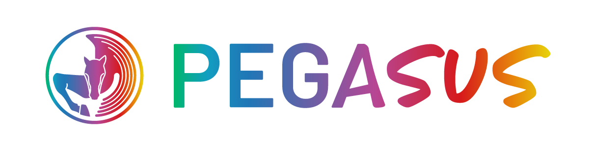
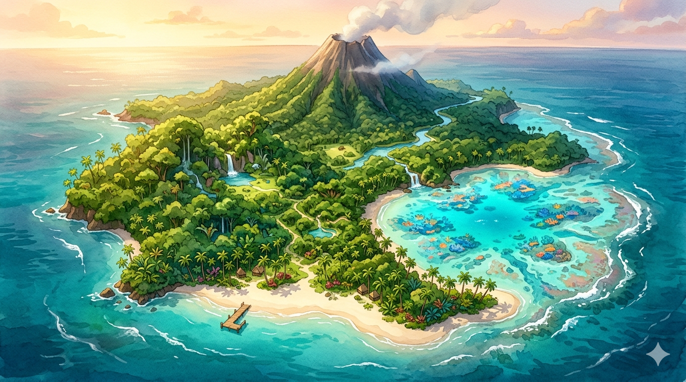

# PROMPT MAESTRO · Claude Code · Gymkana "La Piedra de Te Fiti"

> **Para Claude Code:** lee este documento entero antes de empezar a escribir código. Es la especificación funcional, visual y técnica completa de la gymkana. Todos los assets ya están generados y en su sitio.

---

## 0 · Contexto del proyecto

**Fundación Pegasus** es una entidad terapéutica española que trabaja con peques con discapacidad intelectual y sus familias. Organiza jornadas trimestrales llamadas **"Papás al Juego"**, donde el equipo terapéutico monta gymkanas inclusivas para que padres e hijos jueguen juntos.

Este HTML que vas a construir es la **gymkana de Logopedia** para la jornada de junio 2026, diseñada por **Cecilia** (logopeda del equipo). Funciona en una tablet/portátil en la sala, con sonido por altavoz. La familia juega junta guiada por la logopeda. Sin login, sin servidor, sin internet — un único HTML autocontenido.

**Encargo explícito de Álvaro a Cecilia:** "mandame algo IMPOSIBLE, que sea CINE, lo IDÍLICO para nuestros peques. Usaremos generación de sonidos, imágenes, voces…". Por eso esta gymkana usa stack multi-IA: voces ElevenLabs, música Suno, sound FX, imágenes Disney/Gemini.

---

## 1 · Filosofía Pegasus (INNEGOCIABLE)

- **No paternalismo, no lástima, no infantilización, no normalización forzada.**
- Sí: aprendizaje camuflado, vínculo familia-peque, humor controlado, valencia positiva.
- Tono del historiador: épico-narrativo, NO infantil. Habla como narrador de documental serio.
- Tono general: aventura, descubrimiento, equipo. NO "muy bien peque, qué bonito".
- El peque es un explorador, no un paciente.

---

## 2 · Visión narrativa (PDF de Cecilia)

**Premisa:** La poderosa piedra de Te Fiti se ha roto en **4 fragmentos** dispersos por una isla polinesia. Moana, Maui y Hei Hei piden al peque ayuda para recuperarlos antes de que la oscuridad se extienda.

**Estructura:**

| Punto | Lugar | Actividad | Fragmento |
|---|---|---|---|
| 1 | Entrada de la isla | Elegir personaje (Moana / Maui / Hei Hei) | — |
| 2 | Laguna submarina | A) Baile de las olas (vídeo YouTube) + B) Sopa de imágenes (encontrar repetidas) | 1 |
| 3 | Orilla encantada | Cuenco de palabras: pares mínimos (discriminación auditiva) | 2 |
| 4 | Bosque de los secretos | Historia social → resolver qué necesita el personaje → introducir código en candado | 3 |
| 5 | Volcán | "¡Ahora caigo en el volcán!" 3 preguntas para peques + 4 preguntas para padres | 4 |
| FINAL | — | Piedra completa + aparición de Te Fiti | — |

**Reglas que pidió Ceci explícitamente:**
- Voz del historiador narra todo el recorrido.
- Personajes se mueven por el mapa libremente (no es secuencial estricto, se puede volver a actividades ya hechas).
- Cada actividad superada → se enchufa un fragmento a la piedra (indicador permanente).
- Al juntar los 4 fragmentos → aparece Te Fiti y habla con voz mística.

---

## 3 · Estructura técnica del HTML

- **Single-file HTML** autocontenido. CSS y JS inline. Sin frameworks.
- **No localStorage / sessionStorage** — el estado vive en memoria (variables JS).
- **No internet en runtime** salvo el embed de YouTube del punto 2A.
- **Web Audio API** para reproducir MP3 (no usar `<audio>` tag para SFX, mejor `new Audio()` con preload).
- **Una sola página** con escenas que se muestran/ocultan con clase `.show` / display:none.

**Path del archivo final:**
```
07_papas-al-juego/junio-2026/logopedia/index.html
```

Los assets se referencian con paths relativos:
```
assets/imagenes/personajes/moana.png
assets/audio/voz-historiador/historiador-01-inicio.mp3
```

---

## 4 · Inventario completo de assets (todos generados, todos en su sitio)

### 4.1 · Imágenes (40 PNG)

**`assets/imagenes/personajes/`** (4 PNGs)
- `moana.png` — Moana con remo
- `maui.png` — Maui con anzuelo
- `hei-hei.png` — el pollo
- `te-fiti.png` — la diosa verde (sale solo al final)

**`assets/imagenes/piedra/`** (1 PNG)
- `piedra-completa.png` — la piedra entera. **DEBES generar tú con CSS/JS los 4 fragmentos** posicionando 4 clones de esta imagen con `clip-path` o dividiendo la imagen en 4 cuadrantes. Cada fragmento empieza oculto y aparece cuando se consigue.

**`assets/imagenes/mapa/`** (1 PNG)
- `isla-tefiti.png` — mapa aéreo de la isla generado por Gemini. Cinematográfico. Hay que sobreponer 5 paradas clicables en posiciones SVG/absolutas. Es horizontal 16:9.

**`assets/imagenes/iconos-candado/`** (10 PNGs) — para el punto 4
- `mama.png` · `papa.png` · `persona-adulta.png` · `lupa.png` · `monedero.png` · `llaves.png` · `juguete.png` · `libro.png` · `zapatos.png` · `mochila.png`

**`assets/imagenes/sopa-de-imagenes/`** (23 PNGs) — para el punto 2B
- `aletas.png` · `bikini.png` · `camara.png` · `cangrejo.png` · `cesta.png` · `coral.png` · `cubo-de-arena.png` · `cucurucho-de-helado.png` · `estrella-de-mar.png` · `flor-hibisco.png` · `flotador.png` · `gafas-de-sol.png` · `gafas-snorkel.png` · `medusa.png` · `palmera.png` · `pelota-playa.png` · `pez-tropical.png` · `sandia.png` · `sol.png` · `sombrero.png` · `sombrilla-de-playa.png` · `tortuga-marina.png` · `tumbona.png`

**Pegasusito** (mascota oficial Pegasus):
- Está en `../../../01_pegasus-studio/casting/pegasusito/`
- Poses disponibles: `pegasusito-saludando.png` · `pegasusito-pensativo.png` · `pegasusito-celebrando.png` · `pegasusito-trabajando.png` · `pegasusito-curioso.png` · `pegasusito-vacaciones.png` · `pegasusito-explorador.png`

**Imagotipo Pegasus** (obligatorio en todas las pantallas):
- `../../../assets/imagotipo-pegasus-horizontal-color.jpg`

### 4.2 · Audio (40 MP3)

**`assets/audio/voz-historiador/`** (7 MP3) — voz del narrador en español, grave, documental
- `historiador-01-inicio.mp3` — Bienvenida (se reproduce al hacer click en "EMPEZAR" después del Pegasusito saludando)
- `historiador-02-laguna.mp3` — Intro punto 2
- `historiador-03-orilla.mp3` — Intro punto 3
- `historiador-04-bosque.mp3` — Intro punto 4
- `historiador-05-volcan.mp3` — Intro punto 5
- `historiador-06-final.mp3` — Pre-Te Fiti (después de juntar los 4 fragmentos)
- `historiador-victoria.mp3` — Genérico, suena tras conseguir cada fragmento

**`assets/audio/voz-te-fiti/`** (1 MP3)
- `te-fiti-final.mp3` — frase final mística

**`assets/audio/pares-minimos/`** (16 MP3) — voz femenina clara, 1 palabra por audio
- `pala.mp3` · `bala.mp3`
- `cama.mp3` · `gama.mp3`
- `tos.mp3` · `dos.mp3`
- `foto.mp3` · `jota.mp3`
- `mata.mp3` · `nata.mp3`
- `pero.mp3` · `pelo.mp3`
- `coro.mp3` · `toro.mp3`
- `chapa.mp3` · `llapa.mp3`

**`assets/audio/musica/`** (3 MP3) — música polinesia
- `musica-isla-loop.mp3` — loop ambiental ukelele, suena bajito durante el mapa y las actividades
- `musica-volcan-epico.mp3` — entra al activar el punto 5
- `musica-final-tefiti.mp3` — entra cuando se completa la piedra y aparece Te Fiti

**`assets/audio/sound-fx/`** (8 MP3)
- `sfx-olas-loop.mp3` — fondo de olas
- `sfx-splash.mp3` — splash al elegir personaje / al volver al mapa
- `sfx-chime-fragmento.mp3` — al ganar un fragmento
- `sfx-candado-abrir.mp3` — punto 4
- `sfx-volcan-fuego.mp3` — punto 5
- `sfx-caer-volcan.mp3` — fallar pregunta en punto 5
- `sfx-revive.mp3` — recuperarse tras fallar
- `sfx-piedra-completa.mp3` — final, al juntar los 4 fragmentos

---

## 5 · Especificación funcional · pantalla a pantalla

### Pantalla 0 · Bienvenida con Pegasusito (al cargar)

- Fullscreen.
- Pegasusito-saludando.png a la izquierda (grande, ~40vh).
- Bocadillo a la derecha con título "¡Bienvenidos a una aventura!" y texto: "El océano os está llamando. Una piedra mágica se ha roto y la isla necesita vuestra ayuda. ¿Estáis listos?"
- Botón grande "▶ EMPEZAR LA AVENTURA".
- Al hacer click → suena `historiador-01-inicio.mp3` + transición a Pantalla 1.

### Pantalla 1 · Selección de personaje

- Fondo: degradado oceánico turquesa.
- Título: "ELIGE A TU GUÍA".
- 3 tarjetas en fila con: Moana / Maui / Hei Hei (las 3 PNGs grandes).
- Bajo cada uno, su nombre y una frase corta:
  - **Moana** — "Valiente y decidida"
  - **Maui** — "Fuerte y divertido"
  - **Hei Hei** — "Despistado pero con suerte"
- Al hacer click en uno → splash sound + el personaje elegido queda guardado en `window.heroe = "moana" | "maui" | "hei-hei"` + transición al Mapa.
- Cuando termina el audio del historiador, se reproduce automáticamente.

### Pantalla MAPA (centro de operaciones permanente)

Esta es la pantalla principal. Se vuelve a ella tras cada actividad.

**Layout:**
- Fondo: la imagen `isla-tefiti.png` ocupando todo el viewport.
- En la **esquina superior derecha**: indicador de fragmentos (la piedra-completa con las 4 partes, las conseguidas brillan, las no conseguidas opacas/grises).
- **Sobre el mapa**: 5 paradas representadas como círculos con número y un pin (`emoji o SVG icon`). Posiciones aproximadas (ajusta según el dibujo de Cecilia en `referencias-pdf/REF-mapa-dibujado-ceci.jpg`):
  - **Parada 1 · Inicio** — esquina superior izquierda
  - **Parada 2 · Laguna** — derecha, en el coral
  - **Parada 3 · Orilla** — playa sur
  - **Parada 4 · Bosque** — centro (zona verde)
  - **Parada 5 · Volcán** — norte (junto al volcán)
- **Avatar del personaje elegido** flotando sobre el mapa, posición inicial parada 1. Al hacer click en otra parada, animación CSS de movimiento (~1 seg) hasta la nueva posición.
- Las paradas YA COMPLETADAS muestran un sello verde "✓" o el fragmento ganado.
- Las paradas SIN COMPLETAR se pueden visitar libremente (no hay lock, el peque va donde quiere).

**Audio:**
- Música `musica-isla-loop.mp3` en bucle, volumen 0.3.
- SFX `sfx-olas-loop.mp3` también en bucle, volumen 0.2.

**Banda superior:**
- Imagotipo Pegasus fijo arriba izquierda (regla del CLAUDE.md).
- Indicador "Fragmentos: 2/4" arriba derecha.

### Punto 2 · La laguna submarina

**Pantalla 2A · Pegasusito intro** (transición desde mapa):
- Pegasusito-curioso fullscreen + voz historiador `historiador-02-laguna.mp3` reproduciéndose.
- Botón "▶ A LA LAGUNA".

**Pantalla 2B · Baile de las olas (vídeo):**
- Título: "Bailad las olas".
- Embed de YouTube: `https://www.youtube.com/watch?v=KXewT-mhoPk` (modo iframe, no autoplay para no asustar).
- Texto explicativo: "Ved el vídeo e intentad seguir los movimientos. Cuando termine, daos al botón."
- Botón "▶ HEMOS BAILADO" al final.

**Pantalla 2C · Sopa de imágenes:**
- Grid 5×5 de 23 iconos veraniegos.
- **Importante:** algunos iconos están **REPETIDOS** (poner 5 repeticiones aleatorias entre las 23). El peque debe clicar las repetidas.
- Cada clic en un icono lo marca con un borde. Si las 5 repeticiones están seleccionadas → "¡Bien!" → ganar fragmento 1.
- Si hace clic en uno NO repetido → animación de error suave (shake) y se desmarca.
- Layout en `<div class="sopa-grid">` con `grid-template-columns: repeat(5, 1fr)`.

**Recompensa común tras 2A+2B:**
- Pegasusito-celebrando fullscreen.
- SFX `sfx-chime-fragmento.mp3`.
- Audio `historiador-victoria.mp3`.
- Fragmento 1 se añade al indicador.
- Botón "▶ VOLVER AL MAPA".

### Punto 3 · La orilla encantada

**Intro:** Pegasusito-pensativo + `historiador-03-orilla.mp3`.

**Mecánica:**
- Pantalla con un cuenco/jarrón dibujado (SVG o emoji 🏺) en el centro.
- Dentro flotan 4 tarjetas (CSS animation `float`) con palabras escritas: el par actual.
- Botón "▶ ESCUCHAR" que reproduce un MP3 aleatorio del par mínimo activo.
- El peque debe clicar la tarjeta con la palabra que ha escuchado.
- 5 rondas (5 pares distintos al azar de los 8 disponibles).
- Tras superar 5 → fragmento 2.

**Implementación de pares:**
```js
const paresMinimos = [
  { a: 'pala', b: 'bala' },
  { a: 'cama', b: 'gama' },
  { a: 'tos', b: 'dos' },
  { a: 'foto', b: 'jota' },
  { a: 'mata', b: 'nata' },
  { a: 'pero', b: 'pelo' },
  { a: 'coro', b: 'toro' },
  { a: 'chapa', b: 'llapa' },
];
// Cada ronda: elegir par aleatorio, mostrar 4 tarjetas (a, b, distractor1, distractor2),
// reproducir uno al azar, peque debe clicar la tarjeta correcta.
```

**Audio:** `new Audio('assets/audio/pares-minimos/' + palabra + '.mp3').play()`.

### Punto 4 · El bosque de los secretos

**Intro:** Pegasusito-curioso + `historiador-04-bosque.mp3`.

**Mecánica (historias sociales con candado):**

Se generan **3 historias secuenciales** (las 3 a resolver para conseguir el fragmento):

**Historia A:**
> "Sara quiere encontrar su juguete favorito en el salón. ¿Qué necesita?"
- Pictogramas a elegir (4 visibles, solo uno correcto): `lupa.png` (correcto) + distractores (`monedero.png`, `zapatos.png`, `libro.png`).
- Al clicar el correcto → "¡Bien! Sara necesita una lupa."

**Historia B:**
> "Lucas quiere comprar un regalo a su madre. ¿Qué le falta?"
- Pictogramas: `monedero.png` (correcto) + distractores.

**Historia C:**
> "Marta no encuentra la salida. ¿A quién pide ayuda?"
- Pictogramas: `persona-adulta.png` o `mama.png` (correcto) + distractores.

**Tras las 3 historias:** se muestra un **candado SVG** dibujado y los 3 iconos correctos forman el "código secreto" debajo. SFX `sfx-candado-abrir.mp3`, animación de apertura → fragmento 3.

### Punto 5 · El volcán

**Intro:** Pegasusito-pensativo + `historiador-05-volcan.mp3` + cambia música a `musica-volcan-epico.mp3` (fade out de la isla, fade in épica).

**Mecánica · "¡Ahora caigo en el volcán!"**

Pantalla con un volcán SVG/CSS al fondo, posición del personaje en la cima (borde del cráter).

**3 preguntas para peques** (con pictogramas de apoyo) + **4 preguntas para papás** (sin apoyo visual, más enrevesadas).

Sugerencias de preguntas:

**Para peques (pictogramas):**
1. "¿Cuál de estas frutas es roja?" → opciones con imágenes (sandía / plátano / pera). Correcta: sandía.
2. "Señala el animal que vive en el mar" → tortuga / pájaro / perro. Correcta: tortuga.
3. "¿Qué usamos para no quemarnos en la playa?" → gafas-sol / sombrero / pelota. Correcta: sombrero (o gafas).

**Para papás (sin pictogramas, más exigentes):**
1. "Animal marino con 8 brazos que cambia de color."
2. "Capital de una isla volcánica española."
3. "Película de Disney donde el océano elige a una niña."
4. "Material con el que se hacían los anzuelos de Maui en la leyenda polinesia."

Si fallan → animación de "caer al volcán" (CSS keyframes del personaje cayendo), SFX `sfx-caer-volcan.mp3`, mensaje "¡Has caído! Pero los semidioses reviven…", SFX `sfx-revive.mp3`, vuelta al estado de la pregunta. Sin penalización real, pueden reintentar.

Tras superar las 7 preguntas (3+4) → fragmento 4.

### FINAL · La piedra renace

**Activación:** al conseguir el cuarto fragmento.

**Secuencia:**
1. Vuelta al mapa.
2. Pantalla negra fade-in.
3. SFX `sfx-piedra-completa.mp3`.
4. Música cambia a `musica-final-tefiti.mp3`.
5. Audio `historiador-06-final.mp3` ("Habéis recuperado los cuatro fragmentos. Desde el corazón de la isla… algo despierta").
6. Animación: los 4 fragmentos vuelan al centro y se unen en la piedra completa (CSS keyframes con `transform`).
7. La piedra brilla (filter glow, animation).
8. Aparición de Te Fiti: `te-fiti.png` se eleva desde abajo (animation translate Y).
9. Audio `te-fiti-final.mp3` se reproduce mientras Te Fiti está a pantalla completa.
10. Al terminar el audio, botón "▶ FIN DE LA AVENTURA".
11. Pantalla final: Pegasusito-vacaciones + texto "Habéis salvado la isla. Buenas vacaciones 🌊".

---

## 6 · Reglas innegociables (del CLAUDE.md de Pegasus)

### Branding Pegasus

**Imagotipo siempre visible** arriba a la izquierda:
```html

```
```css
.brand-logo {
  position: fixed;
  top: 12px; left: 12px;
  height: 36px;
  z-index: 90;
  border-radius: 999px;
  background: #fff;
  padding: 4px 10px;
  box-shadow: 0 4px 12px rgba(0,0,0,0.20);
}
@media (max-height: 720px) { .brand-logo { height: 28px; top: 8px; left: 8px; } }
```

### Responsive (debe caber en 1366×768 a zoom 100%)

1. `#stage { position: fixed; inset: 0; overflow: hidden }` y `html,body { overflow: hidden; height: 100% }`.
2. Imágenes grandes: `max-height: 40vh` o `min(280px, 35vh)`.
3. Tarjetas/hosts: `max-height: 86vh; max-width: min(94vw, 900px); overflow: hidden`.
4. Paddings: `padding: clamp(12px, 2vh, 24px)`.
5. Títulos: `font-size: clamp(24px, 4vh, 48px)`.
6. Botones: max `padding: 12px 28px`, reducir en `@media (max-height: 720px)`.
7. Grids: `gap: 8px` no 18px.
8. Mapa SVG/imagen: `height: min(45vh, 320px)` si el mapa no es el fondo.
9. Mapa como fondo: `object-fit: cover` ocupa todo el viewport.
10. Media query base obligatoria:
```css
@media (max-height: 720px) {
  .scene { padding: 12px; }
  .act-host { padding: 18px 22px; max-height: 90vh; }
  .act-host h2 { font-size: 24px; }
  .btn { padding: 12px 26px; font-size: 16px; }
}
```

### Pegasusito · 4 momentos canónicos

Toda gymkana tiene al menos:
1. Bienvenida — pose saludando
2. Transición entre actividades (intro/fin) — pose pensativo/curioso/celebrando
3. Antes del clímax (punto 5) — pose pensativo o curioso
4. Despedida — pose vacaciones

Pegasusito NUNCA aparece como bocadillo decorativo pequeño. Si aparece, ocupa la pantalla completa.

### Lecciones aprendidas (NO repetir errores)

1. **Mecánicas con éxito/fallo real.** No es "voltear tarjetas y ya". Hay deducción y posibilidad de error.
2. **Historias del PDF van en pantalla previa con Pegasusito**, no como párrafo dentro del minijuego.
3. **Toast info arriba, no abajo** (no tapa el botón principal).
4. **Botones sin `transition: transform`** (se come el primer click). `touch-action: manipulation` siempre.
5. **Sonidos Web Audio API claramente distintos**: tipo de onda + capas + duración + envelope. (Aquí usamos MP3 reales, así que basta con preload).
6. **Si una pantalla no entra a 720px de alto, hay que recortar.**

---

## 7 · Patrón técnico recomendado

### Estructura HTML general

```html
<!DOCTYPE html>
<html lang="es">
<head>
  <meta charset="UTF-8">
  <title>La Piedra de Te Fiti · Gymkana Logopedia · Papás al Juego junio 2026</title>
  <style>/* todo el CSS */</style>
</head>
<body>
  

  <div id="stage">
    <!-- Pantalla 0 · bienvenida -->
    <section class="scene scene-bienvenida show" id="bienvenida"> ... </section>

    <!-- Pantalla 1 · elegir personaje -->
    <section class="scene scene-personaje" id="personaje"> ... </section>

    <!-- Pantalla mapa -->
    <section class="scene scene-mapa" id="mapa">
      <div class="indicador-fragmentos"> ... </div>
      
      <div class="parada parada-1" data-punto="1"> ... </div>
      <div class="parada parada-2" data-punto="2"> ... </div>
      <!-- ... -->
      
    </section>

    <!-- Pantallas de puntos 2-5 -->
    <section class="scene" id="punto-2-intro"> ... </section>
    <section class="scene" id="punto-2-video"> ... </section>
    <section class="scene" id="punto-2-sopa"> ... </section>
    <!-- ... -->

    <!-- Pegasusito modal reutilizable -->
    <div class="pegasusito-fullscreen" id="pegasusitoModal"> ... </div>

    <!-- Final · Te Fiti -->
    <section class="scene scene-final" id="final"> ... </section>
  </div>

  <script>
    // Estado global
    const estado = {
      heroe: null,
      fragmentos: [false, false, false, false],
      paradasCompletadas: [false, false, false, false, false],
    };

    // Sistema de audio
    const audios = {
      historiador: {},
      paresMinimos: {},
      musica: {},
      sfx: {},
    };

    // Preload todos los audios al inicio
    function preloadAudios() { ... }

    // Sistema de navegación entre pantallas
    function mostrarEscena(id) { ... }

    // Pantalla Pegasusito reutilizable
    function mostrarPegasusito({ titulo, texto, pose, cta, onContinuar }) { ... }

    // Lógica de cada minijuego
    // ...

    // Init
    window.addEventListener('load', () => {
      preloadAudios();
      mostrarEscena('bienvenida');
    });
  </script>
</body>
</html>
```

### Sistema de audio

```js
function reproducir(grupo, nombre, opciones = {}) {
  const audio = audios[grupo][nombre];
  if (!audio) return;
  audio.currentTime = 0;
  audio.volume = opciones.volume ?? 1.0;
  audio.loop = opciones.loop ?? false;
  audio.play().catch(() => {}); // ignora errores autoplay
}

function fadeOut(audio, ms = 1000) { ... }
function fadeIn(audio, ms = 1000, targetVolume = 1.0) { ... }
```

### Mapa de paradas

Posiciones absolutas en porcentajes sobre la imagen del mapa. Calibrar usando `REF-mapa-dibujado-ceci.jpg` como referencia de dónde puso Ceci cada punto.

```css
.parada {
  position: absolute;
  width: 60px; height: 60px;
  border-radius: 50%;
  background: rgba(255,255,255,0.9);
  border: 4px solid var(--pegasus-morado);
  cursor: pointer;
  display: flex; align-items: center; justify-content: center;
  font-size: 24px;
  transition: transform 0.2s;
  z-index: 10;
}
.parada:hover { transform: scale(1.1); }
.parada.completada { background: #5cb85c; }
.parada-1 { top: 18%; left: 12%; }
.parada-2 { top: 35%; left: 72%; }
.parada-3 { top: 65%; left: 35%; }
.parada-4 { top: 45%; left: 50%; }
.parada-5 { top: 15%; left: 60%; }
```

---

## 8 · Entrega

- Generar **un único archivo** `index.html` en `07_papas-al-juego/junio-2026/logopedia/`.
- No crear archivos extra ni dependencias.
- Testear que abre con doble-click sin servidor.
- Verificar que **TODO entra sin scroll en 1366×768 a zoom 100%** (regla nº 1 del CLAUDE.md).
- Verificar que el imagotipo Pegasus está visible en TODAS las pantallas.
- Verificar que el audio del historiador suena en cada intro de punto.
- Verificar que el peque puede volver al mapa en cualquier momento desde cualquier punto.

---

## 9 · Estilo visual

- **Paleta principal:** colores oceánicos turquesa-azul + acentos cálidos del atardecer (naranja-coral). En las pantallas de actividades, fondos claros sutiles para que el contenido se lea bien.
- **Tipografías:** sans-serif limpia (system-ui, -apple-system, Segoe UI). No usar fuentes infantiles tipo Comic Sans.
- **Bordes redondeados generosos** (border-radius 16-24px en tarjetas).
- **Sombras suaves** (`box-shadow: 0 4px 20px rgba(0,0,0,0.12)`).
- **Animaciones cubic-bezier ease-out**, duraciones cortas (200-400ms).

---

## 10 · Si tienes dudas durante la construcción

Si encuentras ambigüedades:
- **Defecto correcto:** lo que dice este documento.
- **Si no está escrito aquí:** consulta `referencias-pdf/` (PDF y boceto de Ceci) y el `ASSETS.md`.
- **Si sigue sin estar claro:** preferir minimalismo cinematográfico (menos elementos, mejor cuidados).

---

*Documento generado: 9 junio 2026. Autor: Álvaro Díaz (director Fundación Pegasus) con Claude.*
